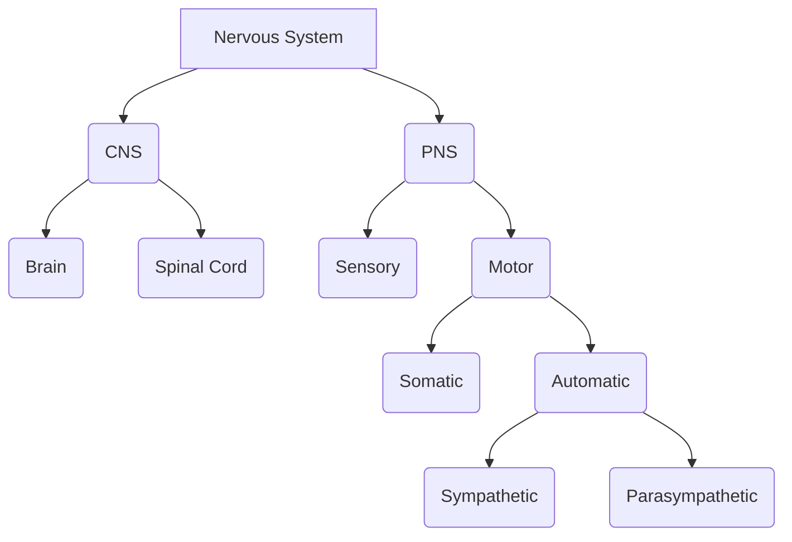

# Biol 273

## Unit 1

#### Homeostatic Control Systems
  * Stability comes from balancing input and output
  * __Negative Feedback__ returns variables to original condition
  * Homeostatic systems maintain similarity NOTE: homeostasis is similar not constant
  * set points can be reset (set points are like temp, bp, etc)
  * Control requires Cell Communication [Unit 7](../BIOL\ 130/BIOL130_LEC_16.md)

#### Feedback and response loops
  * Reflex steps in feedback loops
    * Stimulus -> sensor -> input signal -> integrating center -> output signal -> target -> response
    * In an example:
    * touch hot object -> cells on fingertips -> sensor pathway -> spinal cord (figures out what to do) -> motor pathway -> muscle -> pull arm away
  * Feedback loop when response impacts the stimulus in some way
  * can be positive/negative and feed-forward

#### Negative Feedback
  * ends in shutting off initial stimulus

#### Positive Feedback
  * reinforces the initial stimulus
  * draws parameter away from set point
  * requires external stimuli to stop positive feedback loop
  * example:
    * Positive feedback loop in Labour
    * Cervical stretch -> oxytocin release -> uterine contractions -> push baby against cervix
    * ends in delivery (stops cervical stretch)

#### Feedforward Control
  * Anticipatory control:
    * starts response loop

## Unit 2
#### Nervous System Function
  * Integrated with endocrine
  * is a key control structure
  * Receives information from sensory neurons (receptors) both internally and externally
  * Integrates information by organizing it with already stored information
  * Transduce information, typically to muscles or glands

#### Central Nervous System
  * Clusters of cell bodies -> nuclei
  * bundles of axons (forming a pathway) -> tracts

#### Peripheral Nervous System
  * Everything else belongs to PNS
  * PNS consists of mostly nerves and ganglia

|CNS|PNS|
|:---|:---|
|nuclei|ganglia|
|tracts|nerves|

#### Components of Nervous System

  * Afferent neurons transmit __to__ the integrating center
  * integrating center is made up of interneurons
  * most of neurons are interneurons
  * interneurons transmit within the CNS
    * Laterally within spinal cord
    * Vertically towards the brain
  * Efferent motor neurons transmit to effectors
    * cluster of cell bodies _in_ CNS for efferent motor neurons are Nuclei
    * neurons that carry away information are nerves

#### Cells in the nervous system
* cell clusters
* axons

#### Typical Neuron
* Neurons have 4 main parts:
  * Soma - cell body
  * Dendrites - branches from the cell body, receives information transmits toward soma
  * Axon - large branch that transmit away from soma
* Psudounipolar
  * somatic sensory neuron
  * axon and dendrites fused for form one long process
* Bipolar
  * smell/vision sensory neurons
  * single axon and dendrite
* Anaxonic
  * interneuron with no apparent axon
* Multipolar (CNS)
  * highly branched, short extensions
* Multipolar (efferent)
  * 5-7 dendrites
  * single long axon

#### Glial cells
  * Outnumber neurons 10-50:1
  * Glial cells don't carry electrical signals over long distances
  * support neurons and allow them to function
  * Two types:
    * Schwann cells - wraps around axons of psudounipolar called myelin (myelination) acting as an electrical insulator
    * Satellite cells - non-myelinating cell that support nerve cell bodies

#### Review Qs
  * Where can receptors be found? (Cytosol, membrane, muscle)
