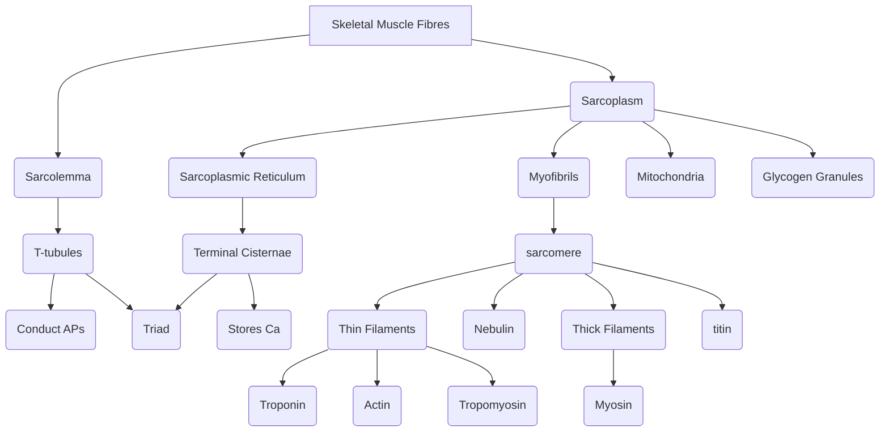

# Biol 273

## Unit 3

#### Muscle Fibre Structure

* Structure within individual skeletalmuscle cells (fibres)
* Surrounded by cell membrane (sarcolemma)
* Myofibrils surrounded by specialized ER (sarcoplasmic reticulum)
* T-tubules, lumen continuous with ECF
* T-tubule sandwiched between Sarcoplasmic reticulum forms Triad
* SR ends have Terminal Cisternae which store $Ca^{2+}$

| General Terms | Muscle Equivalent |
| --- | --- |
| Muscle Cell | Muscle Fibre |
| Cell membrane | Sarcolemma |
| Cytoplasm | Sarcoplasm |
| Modified ER | Sarcoplasmic Reticulum |

#### Striated muscles
* Components of sarcomere
  * Z line (disk) zwischen
  * I band - isotropic band
  * A band - anisotropic band
  * H zones - helles zone
  * M line (disk) mittel
* Caused by protein components

#### Myosin
* Two proteins heads joined to the tail
* Interact at a flexible hinge
* Hundreds of myosin form thick filament
* Thick filament myosin tails orient towards m-line

#### Actin
* Subunuts are globular (G-actin)
* Actin polymerizes into filaments (F-actin)
* Two F-actin twist together to form thin filaments
* Troponin and tropomyosin regulate thin filament structure

#### Myosin heads interact with actin directly
* Interactions are called cross-bridges
* Two main active sites: actin binding site and atp binding site
* Organization of thick and thin filaments form sarcomere

#### Other accessory proteins
* Titin provides elasticity and stabilizes myosin
* Nebulin at center of thin filaments

#### Mechanism of muscle contraction
* Muscles shorten when they contract
* Early theories suggested proteins shorten
* Because myosin shrinks when heated up
* Experimental evidence suggests:
  * A-band doesn't shorten during contraction
  * Supports sliding filament theory
  * H-zone shrinks but I-band and A-band doesn't shorten
* Cross-bridge cycling

#### Filament movement
1. Cross bridges at 45°, myosin bound tightly to actin (rigor state) then ATP binds
1. Myosin hydrolyzes ATP and causes Myosin head to swing out and weakly binds to next actin
1. $P_i$ dissociates, head rotates on hinge and pulls actin (power stroke)
