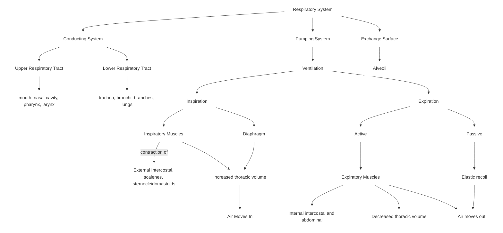

# Biol 273

#### Ventilation
* Physiological term for breathing

#### Two main factors for breathing
1. Compliance (stretchability of the lungs)
1. The resistance to air flow in the airways
  * resistance is adjustable

#### Concept map

#### Lung compliance
* Magnitude of change in lung volume produced by a given change in pressure
* Can result from chronic inhalation of asbestos, silicon, coal dust
* Pulmonary fibrosis (fibrotic lung disease)
* Causes buildup of scar tissue in lungs, reducing compliance
* Systems like cilia-mucus escalator, nasal hairs reduce inhaled foreign objects
* Small particles can bypass systems and get deeper in the lungs, inflaming lungs
* Scar tissue is not the same as the original tissue

#### Surfactants
* Most resistance to stretch comes from surface tension within the lungs
* Surface tension arises because of hydrogen bonding between water molecules
* Surfactants contain mixture of lipoproteins that disrupt cohesive forces between water molecules
* Necessary to reduce surface tension
* Makes lung more compliant
* Secretion is stimulated by deep breathing
* Produced by type 2 alveolar cells

#### New-born Respiratory Distress Syndrome
* Due to inadequate surfactant production
* Surfactant synthesis becomes adequate at 34 weeks gestation
* Babies born prematurely do not produce enough surfactant
* Very low compliance
* Very difficult to breathe
* Amniocentesis can be used to test pre-birth surfactant production
* If birth cannot be delayed, premature babies can be artificially ventilated
* Artificial surfactants have been developed along with artificial ventilation

#### Elastance
* Ability to return to resting volume
* When elastance is low, lung does not return to resting volume passively
* Exporation must be active, not passive
* Can have pathological conditions
* Sac-like structures covered by proteins that are elastic

#### Emphysema
* Elastin fibres normally found in lungs are destroyed
* Lungs have high compliance, but low elastance
* Expands easily but breathing out is forced

#### Airway Resistance
* Resistance $R \propto \frac{8L\eta}{\pi r^4}$
* Normally work needed to overcome resistance is low relative to resistance to stretch
* Mucus accumulation from allergies or infections can greatly increase resistance of airways

#### Bronchiole Diameter
* Affected by nervous system, hormones, paracrines (Table 17.2 Fig)
* CO2 causes bronchodilation
* Histamine causes bronchoconstriction
* Histamines are released in response to tissue damage or allergic reactions
* Severe allergic reactions can cause difficulty breathing

#### Neural control of Bronchioles
* Primarily by parasympathetic neurons that cause bronchoconstriction
* No significant sympathetic innervation
* Circulating epinephrine act on bronchiole smooth muscle cells
* Used as a treatment for asthma

#### Lung volumes

1. Tidal Volume
    * Volume of air moved in a single inspiration or expiration
2. Inspiratory Reserve Volume
    * Volume of air that can be inspired above the tidal volume
3. Expiratory Reserve Volume
    * Amount that can be exhaled after a normal expiration
4. Residual volume
    * Amount of air left in lungs after maximal expiration
5. Vital Capacity
    * Maximum amount of air that can be voluntarily moved in or out of the respiratory system
6. Total Lung Capacity

#### Efficiency of Breathing
* Effectiveness of breathing by measure total pulmonary ventilation -> minute volume
* Dead space, volume of air not involved in gas exchange
* Alveolar ventilation is the amount of air that reaches the alveoli each minute
* Ventilation rate * alveolar volume
